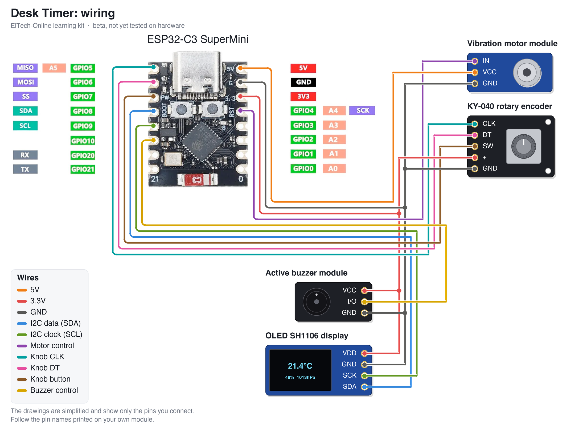

# ElTech-Online ESP32-C3 Desk Timer

[](https://buymeacoffee.com/eltech)

> **Status: BETA, not tested.** The code compiles for the ESP32-C3, but this kit has not been built and tested on real hardware yet. Pin choices, default values and the wiring may still change. Use it to read and learn from; expect to do some fault-finding if you build it now.

A beginner-friendly **learning kit**: build a desk timer from an **ESP32-C3 SuperMini**, a **1.3" OLED SH1106** display, a **KY-040 rotary encoder** (a knob), an **active buzzer** and a **vibration motor**. One knob works a menu, a countdown timer and a Pomodoro work/break timer. No prior electronics or coding experience needed, and no soldering: everything plugs into a breadboard.

Designed, coded and documented by ElTech-Online in Callander, Scotland — the kit design, firmware and this guide are our own work.


## What you'll learn

This kit is about how to organise a program, the part most tutorials skip:

- **Timers without `delay()`** — counting down with `millis()` so the board stays responsive
- **Menus** — a list on a small screen, moved through with a knob
- **A state machine** — the single most useful pattern for any device with buttons and a screen
- **One-knob interfaces** — turn, press and hold, and telling them apart

Along the way you'll also pick up:

- **Reading a rotary encoder** with an interrupt
- **Driving a motor** through a transistor module
- **Saving settings in flash memory**

The code is written to be read: every section is commented in plain language, and [How the code works](#how-the-code-works) walks through it.

## How a state machine works

A timer has a surprising number of situations: showing the menu, setting the time, running, paused, finished, in the settings. The same press of the knob means something different in each.

Written the obvious way, that turns into a tangle of *"if it is running, but not paused, and we are not in the menu..."*. A **state machine** avoids it with one rule: the device is always in exactly **one** state, and each state has its own short function.

```
MENU --press--> SET_TIME --press--> RUNNING --press--> PAUSED
                                       |                  |
                                   time is up         press = resume
                                       v
                                     DONE --press--> MENU (or the next Pomodoro phase)

hold = back to MENU from anywhere
```

In the sketch, `loop()` reads the knob and then calls the function for the current state. Adding a feature means adding a state, and nothing else changes.

**The countdown** uses the same idea of not waiting. Instead of counting seconds one at a time, the sketch works out the moment the countdown will *end*, and each time round `loop()` it compares that with the clock. The board can be busy for a moment and the timer is still exact.

## What it does

- **Timer**: turn to set 1 to 180 minutes, press to start, press to pause and resume
- **Pomodoro**: 25 minutes of work, then a 5 minute break, repeating, with a count of the work sessions
- When time is up: the buzzer beeps, the motor buzzes and the screen flashes until you press the knob (or for 30 seconds)
- **Settings**: sound on/off and vibration on/off, so it can be a silent timer
- Remembers the last time you set, and the settings, when the power is off

It also runs a self-test at power-on and prints it to Serial (115200 baud):

```
--- Self-test ---
OLED (SH1106): OK
Rotary knob:   OK
Buzzer:        beeped once (check by ear)
Motor:         buzzed once (check by touch)
RESULT:        PASS
```

There are **two sketches** in this repo:

| Sketch | What it is |
|---|---|
| `encoder_test/` | The smallest useful start: a number that goes up and down as you turn the knob. Begin here. |
| `desk_timer/` | The full project: menu, timer, Pomodoro and settings. |

## Hardware

| Component | Notes |
|---|---|
| ESP32-C3 SuperMini |  |
| 1.3" OLED, SH1106 driver, 128×64, I2C | Address `0x3C` (try `0x3D` if blank) |
| KY-040 rotary encoder module | 5 pins: `CLK`, `DT`, `SW`, `+`, `GND` |
| Active buzzer module ("Low level trigger") | 3 pins: `GND`, `I/O`, `VCC` |
| Vibration motor module | 3 pins: `IN`, `VCC`, `GND`. Note the unusual order |
| Breadboard + jumper wires | 15 wires |

## Wiring

| Wire | ESP32-C3 pin | Connects to |
|---|---|---|
| 5V | 5V | Vibration motor module `VCC` |
| 3.3V | 3V3 | KY-040 rotary encoder `+`, Active buzzer module `VCC`, OLED SH1106 display `VDD` |
| GND | GND | Vibration motor module `GND`, KY-040 rotary encoder `GND`, Active buzzer module `GND`, OLED SH1106 display `GND` |
| I2C data (SDA) | GPIO 8 | OLED SH1106 display `SDA` |
| I2C clock (SCL) | GPIO 9 | OLED SH1106 display `SCK` |
| Motor control | GPIO 4 | Vibration motor module `IN` |
| Knob CLK | GPIO 5 | KY-040 rotary encoder `CLK` |
| Knob DT | GPIO 6 | KY-040 rotary encoder `DT` |
| Knob button | GPIO 7 | KY-040 rotary encoder `SW` |
| Buzzer control | GPIO 10 | Active buzzer module `I/O` |



The parts are drawn in a simplified way, showing only the pins you connect. **Always follow the labels printed on your own modules** — the pin order differs between manufacturers.

Good to know:

- **The motor module is powered from 5V**; everything else from 3V3.
- **The buzzer is on 3V3**, so that a HIGH from the ESP32 switches it fully off.
- **Check the motor module's pin order** against its printing: `IN`, `VCC`, `GND` is not the usual order.
- **This kit does not use WiFi.**

## Setup (Arduino IDE)

**Before you start:** download and install the free **Arduino IDE 2** from [arduino.cc/en/software](https://www.arduino.cc/en/software). The ESP32-C3 connects over its own USB-C port, so there's no separate USB driver to install. Use a USB cable that carries data: some cheap cables only charge, and then the board never shows up.

1. **Add the ESP32 board index**: `File > Preferences` → Additional Boards Manager URLs:
   ```
   https://raw.githubusercontent.com/espressif/arduino-esp32/gh-pages/package_esp32_index.json
   ```
2. **Install the board package**: `Tools > Board > Boards Manager`, search "esp32", install **esp32 by Espressif Systems**.
3. **Select the board**: `Tools > Board > esp32 > ESP32C3 Dev Module`.
4. **Tools menu settings**:

   | Setting | Value |
   |---|---|
   | Board | ESP32C3 Dev Module |
   | USB CDC On Boot | Enabled |
   | CPU Frequency | 160MHz |
   | Erase All Flash Before Sketch Upload | Disabled |
   | Flash Size | 4MB (32Mb) |
   | Partition Scheme | Default 4MB with spiffs (1.2MB APP/1.5MB SPIFFS) |
   | Upload Speed | 921600 |

5. **Install libraries** via `Sketch > Include Library > Manage Libraries`:
   - Adafruit SH110X
   - Adafruit GFX Library

   If Library Manager asks to install dependencies (Adafruit BusIO, Adafruit Unified Sensor), click **Install all**.

   **Compiled with** these versions (compile-tested only; hardware confirmation pending):

   | Package | Version |
   |---|---|
   | esp32 by Espressif Systems (board package) | 3.3.11 |
   | Adafruit SH110X | 2.1.15 |
   | Adafruit GFX Library | 1.12.6 |
   | Adafruit BusIO | 1.17.4 |

6. Open `encoder_test/encoder_test.ino` first, upload it, and check the knob. Then open `desk_timer/desk_timer.ino` and upload that.

### Opening the Serial Monitor

1. Open it with `Tools > Serial Monitor`.
2. Set the speed drop-down to **115200 baud**. At the wrong speed, you'll see garbled characters or nothing at all.
3. The self-test only runs once, right after the board starts. If you opened the Serial Monitor too late, press the board's **RST** (reset) button to run it again.

**Seeing nothing at all?** Check that `Tools > USB CDC On Boot` is set to **Enabled**.

### If the upload fails

If the upload stops with an error like `Failed to connect`, put the board into download mode by hand:

1. Hold down the **BOOT** button on the board.
2. While holding it, press and release **RST** (or unplug and re-plug the USB cable).
3. Release **BOOT**, choose the port under `Tools > Port` and click **Upload** again.
4. When the upload finishes, press **RST** once to start the new code.

## Using it

| You do | It does |
|---|---|
| Turn the knob | Moves through a menu, or changes the minutes |
| Press | Chooses, starts, pauses or resumes |
| Hold for 1 second | Goes back to the menu / cancels |

Once it is programmed the timer needs no computer: power it from any USB charger or power bank.

## How the code works

Open `desk_timer/desk_timer.ino` alongside this section. The file starts with a short guide to its own layout. Every Arduino sketch has two main functions: `setup()` runs once when the board starts, and `loop()` then runs over and over, forever.

1. **Settings at the top.** Pins, the Pomodoro times and the alert length are named values you can change in one place.
2. **Outputs.** `setBuzzer()` and `setMotor()` hide whether "on" is HIGH or LOW for each part.
3. **The knob.** `knobTurned()` is the interrupt: it only counts. `readKnob()` turns that into three simple facts for the rest of the code: `turned`, `pressed` and `held`.
4. **The states.** `runMenu()`, `runSetTime()`, `runRunning()`, `runPaused()`, `runDone()` and `runSettings()`: one short function each.
5. **The countdown.** `startCountdown()` works out `endMs`; `runRunning()` compares it with `millis()`.
6. **The screens.** `drawScreen()` draws whatever the current state needs, 20 times a second.

## Try this next

Small changes to try yourself, roughly easiest first. Change one thing, upload, and check the result before moving on.

1. **Change the Pomodoro times.** Edit `POMODORO_WORK_MINUTES` and `POMODORO_BREAK_MINUTES`.
2. **Change the alert pattern.** In `runDone()`, change the numbers that make three short pulses.
3. **Add seconds.** Let the timer be set in steps of 10 seconds below 5 minutes.
4. **Add a stopwatch.** A new menu line and a new state that counts up instead of down.
5. **Add a long break.** After every fourth work session, make the break 15 minutes.
6. **Vary the buzz.** Use `analogWrite(MOTOR_PIN, 120)` for a gentler vibration.

## Beta notes

This repository is published early. Still to be confirmed on real hardware:

- Buzzer loudness on 3.3 V
- Whether the vibration motor's start-up current disturbs the OLED or resets the board on a weak USB supply
- The power-on check for the knob assumes the module has pull-up resistors on CLK and DT

Found a problem? Please open an issue on this repository.

## License

The code, documentation and wiring diagram are MIT-licensed — see [LICENSE](LICENSE). Use them, modify them, build your own kit with them.

**The ElTech-Online name and logo are not covered by the MIT license.** The logo files (`logo.png` and any `logo_bitmap.h`) are © ElTech-Online, all rights reserved. If you build or sell your own version, swap in your own logo and don't present it as an ElTech-Online product.
